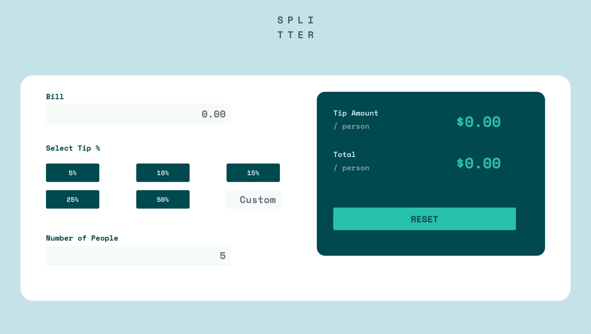
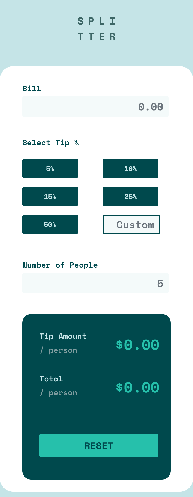

# Frontend Mentor - Tip calculator app solution

This is a solution to the [Tip calculator app challenge on Frontend Mentor](https://www.frontendmentor.io/challenges/tip-calculator-app-ugJNGbJUX). Frontend Mentor challenges help you improve your coding skills by building realistic projects.

## Table of contents

- [Overview](#overview)
  - [The challenge](#the-challenge)
  - [Screenshot](#screenshot)
  - [Links](#links)
- [My process](#my-process)
  - [Built with](#built-with)
  - [What I learned](#what-i-learned)
  - [Useful resources](#useful-resources)
- [Author](#author)

## Overview

### The challenge

Users should be able to:

- View the optimal layout for the app depending on their device's screen size
- See hover states for all interactive elements on the page
- Calculate the correct tip and total cost of the bill per person

### Screenshot

#### Desktop

#### Mobile

### Links

- Solution URL: [Solution](https://github.com/rebekahshaw92/react-tip-calculator-app)
- Live Site URL: [Live Site](https://rebekahshaw92.github.io/react-tip-calculator-app/)

## My Process

### Built with 

- Semantic HTML5 markup
- CSS custom properties
- Bootstrap for React
- React JS
- Mobile-first workflow

### What I Learned 

I decied that I would recreate this task using React as it had been a while since I had used React. This project was straight forward and allowed me to learn more about React.

### Userful Resources 

- [Bootstrap]https://react-bootstrap.github.io) - This site helped me learn all I needed to know about Bootstrap for React.

## Author

- Website - [Rebekah Shaw](https://www.rebekahshaw.com)
- Frontend Mentor - [@rebekahshaw92](https://www.frontendmentor.io/profile/rebekahshaw92)
- Twitter - [@x_beckyboo_x](https://www.twitter.com/x_beckyboo_x)

